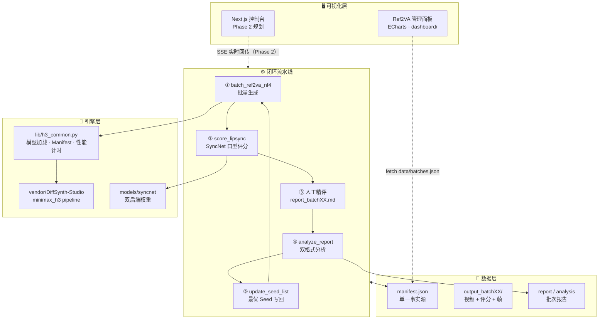

<div align="center">


# MiniMax-H3 · DiffSynth 本地版 AI 数字人生产线

**_YanYuCloudCube_** · _言启象限 | 语枢未来_
**_Words Initiate Quadrants, Language Serves as Core for Future_**
_万象归元于云枢 | 深栈智启新纪元_
**_All things converge in cloud pivot; Deep stacks ignite a new era of intelligence_**

---

<!-- BADGES -->
[](https://github.com/YanYuCloudCube)
[](#-变更历史)
[](LICENSE)
[](docs/10-DGX-Spark部署生产运维指南.md)
[](docs/01-环境部署指南.md)
[](docs/01-环境部署指南.md)
[](docs/03-批量迭代流水线说明.md)
[](docs/05-全局释义与指导文档.md)

</div>

---

## 📖 项目定位

本仓库是 **MiniMax-H3 视频/数字人生成模型在 Apple M4 Max 128GB（MPS）上的完整本地生产线**，
由两份源文档整理抽取而来，按「环境部署 → 推理脚本 → 批量迭代 → 提示词工程」分类归档，可独立使用。

> **源文档**（已归档至 [docs/legacy/](docs/legacy/)）：
> [Mac-M4-Max-128GB-MiniMax-H3-NF4完整部署脚本.md](docs/legacy/Mac-M4-Max-128GB-MiniMax-H3-NF4完整部署脚本.md) · [MiniMax-H3-DiffSynth本地版-提示词模板.md](docs/legacy/MiniMax-H3-DiffSynth本地版-提示词模板.md)
> **规范**：遵循 [YYC³ 团队开发标准](docs/YYC3-团队通用-标规文档/YYC3-团队规范-开发标准.md)（五高 · 五标 · 五化 · 五维驱动）

---

## 🏗️ 可视化体系架构



> 📐 架构细节与 ASCII 全景图见 [审核报告 §1.2](docs/YYC3-MiniMax-H3-impl-expert-20260903/00-项目现状审核报告.md)
> 🧭 可视化生产化三步走路线（**A 数据桥 → B 控制台 → C 插件生态**）见 [11-智能化落地生产可用方案论证](docs/YYC3-MiniMax-H3-impl-expert-20260903/11-智能化落地生产可用方案论证.md)

---

## 📂 目录结构

```text
YYC3-MiniMax-H3/
├── README.md                          ← 本文件（总索引）
├── docs/                              ← 指南文档
│   ├── 01-环境部署指南.md              ← Miniforge + PyTorch MPS + DiffSynth-Studio 安装
│   ├── 02-避坑指南与排障手册.md         ← M4避坑清单 + 报错排查 + 提示词避坑
│   ├── 03-批量迭代流水线说明.md         ← 闭环工作流：生成→打分→分析→更新Seed
│   ├── 04-演进规划与闭环优化机制.md     ← 现状评审 + 行业对标 + 6-Phase演进路线 + 双闭环
│   ├── 05-全局释义与指导文档.md         ← ★ 概念词典 + SOP + 坑位词典（新会话第一篇）
│   ├── 06-项目现状分析与后续建议.md     ← ★ 活文档：实时快照 + 任务表 + 衔接区（每会话更新）
│   ├── 07-闭环预期状态与拓展分析.md     ← ★ 闭环终态定义 + 量化预期 + E1~E7拓展方向
│   ├── 08-开发者文档.md                ← ★ API参考 + 代码示例 + 架构/流程/状态机图
│   ├── 09-文档体系审核与版本控制.md     ← ★ 文档矩阵审核 + 版本控制 + 智能化闭环机制
│   ├── 10-DGX-Spark部署生产运维指南.md  ← ★ GB10迁移路径 + aarch64/CUDA13 + 生产运维体系
│   ├── YYC3-团队通用-标规文档/          ← 团队规范标准（开发标准/五维驱动/文档闭环）
│   ├── YYC3-项目闭环-验收系统/          ← 验收标准体系（代码/功能/测试/安全/性能）
│   └── YYC3-MiniMax-H3-impl-expert-20260903/  ← 本轮会话工作区（审核报告/方案论证/总结）
├── dashboard/                         ← 可视化面板（管理面板 HTML + 数据桥 JSON）
├── prompts/
│   └── README.md                      ← 提示词模板（Ref2VA/FL2VA/音色参考）+ 最佳实践
├── scripts/
│   ├── batch_ref2va_nf4.py            ← ★ 主生成脚本 v2（manifest化+性能基线+断点续跑）
│   ├── score_lipsync.py               ← ★ SyncNet自动口型评分（双后端）
│   ├── lib/h3_common.py               ← ★ 共享库（模型加载/Manifest/性能计时/评分后端）
│   ├── h3_m4_fl2va.py                 ← FL2VA 单次推理（文生音视频，推荐首选）
│   ├── h3_m4_ref2va.py                ← Ref2VA 单次推理（参考图口型同步数字人）
│   ├── batch-full/                    ← 完整版批量（断点续跑+自定义参考图）
│   ├── multi-image-report/            ← 多图批量 + Markdown报告 + 缺陷标签闭环
│   └── pipeline-tools/                ← 闭环流水线工具链（pipeline_auto 五节点）
├── models/syncnet/                    ← 口型评分双权重（sfd_face.pth / syncnet_v2.model）
├── output_batchXX/                    ← 批次产物（manifest.json 单一事实源 + 视频 + 帧）
├── ref_images/                        ← 参考图（数字人形象）
└── vendor/DiffSynth-Studio/           ← 第三方推理引擎（内嵌未改动）
```

---

## 🚀 快速开始

```bash
# 1. 环境部署（详见 docs/01-环境部署指南.md）
conda activate h3-m4

# 2. 单次推理验证
python scripts/h3_m4_fl2va.py

# 3. 数字人口型同步（需参考图）
python scripts/h3_m4_ref2va.py

# 4. 批量生产 + 迭代闭环（v2：含自动口型评分，详见 docs/03、docs/04）
python scripts/pipeline-tools/pipeline_auto.py

# 5. 可视化面板
open dashboard/Ref2VA-流水线管理面板.html
```

---

## 📊 客观评估层（v2）

| 组件 | 说明 |
| ---- | ---- |
| manifest.json | 批次单一事实源：参数/seed/状态/耗时/内存峰值/客观分/人工分 |
| score_lipsync.py | 双后端：SyncNet 优先；无权重自动降级启发式（同步0.98 vs 错位0.76） |
| 性能基线 | 每次推理记录 gen_seconds / peak_rss_gb / mps_alloc_gb |

## 📋 模型权重对照

| 版本 | model_id | 特点 |
| ---- | -------- | ---- |
| NF4 原版 | `DiffSynth-Studio/MiniMax-H3-NF4` | 画质优先 |
| Pruned 剪枝版 | `DiffSynth-Studio/MiniMax-H3-Pruned` | 推理更快、内存更低，画质略降，适合快速试 seed |
| Pruned 精简单文件 | `minimax-h3-fl2va-pruned-nf4.safetensors` | 单文件替换即用 |

## 🔑 关键参数速查

| 参数 | 值 | 说明 |
| ---- | -- | ---- |
| vram_limit | 96 | 128G 统一内存预留 96G |
| 分辨率 | 480×832 | 官方推荐 |
| num_frames | 124 | 必须满足 `% 17 == 5`（Ref2VA） |
| num_inference_steps | 50 | 官方默认 |
| fps / 采样率 | 24 / 32000 | 输出视频规格 |
| 模型缓存 | `~/.modelscope/` | 约 72.5GB，硬盘预留 >100GB |

---

## 📄 许可证

Released under the MIT License.

---

## 🔄 变更历史

| 版本 | 日期 | 变更内容 | 作者 |
| ------ | ---------- | -------- | ---- |
| v2.0.1 | 2026-09-03 | 修复 v2.0.0 内容损坏；Mermaid 架构图规范化；目录结构补全 dashboard/ | Impl Expert |
| v2.0.0 | 2026-09-03 | README v2 重构：yyc3-family.png 顶图 + 徽章系统 + Mermaid 可视化架构 | Impl Expert |
| v1.0.0 | 2026-09-02 | 初始版本（源文档整理归档） | YanYuCloudCube Team |

---

<div align="center">

> 「_**YanYuCloudCube**_」
> 「_**<admin@0379.email>**_」
> 「_**Words Initiate Quadrants, Language Serves as Core for the Future**_」
> 「_**All things converge in cloud pivot; Deep stacks ignite a new era of intelligence**_」

**© 2025-2026 YanYuCloudCube™. All Rights Reserved.**

</div>
