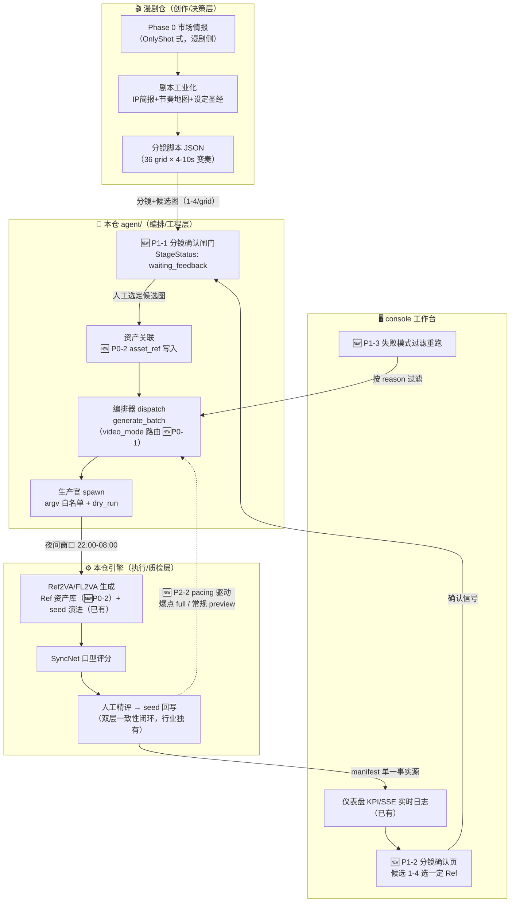

# AI 漫剧/短剧生成 · 功能演进方案（YYC3-MiniMax-H3）

> 输入依据：[MiraFrame](https://github.com/Lsq128/MiraFrame) / [OnlyShot](https://github.com/A-cat-with-carrots/OnlyShot) 双仓库实勘（gh api，2026-10-05）+ 同类开源横向检索（ArcReel 5.2k★ / Toonflow 10k+★ / BigBanana AI Director）+ 指导文档《AI漫剧/短剧生成开源项目核心功能开发者指导》。
> 本仓定位：**执行引擎层**（视频生成 + 质检 + seed 演进 + agent 网关），创作/决策层（剧本/分镜/节奏）在漫剧仓（YYC3 AI Family-Comic Drama）。

---

## 一、实勘结论与横向表修正

### 1.1 双仓库实勘（与指导文档交叉验证）

| 项 | 实勘结论 | 与指导文档差异 |
| ---- | ---- | ---- |
| MiraFrame 定位 | 全 TS 学习原型（自述"不建议直接生产"）；四包 monorepo；`shared` 为 Zod 单一数据源；server→agent 单向依赖 | 一致 |
| MiraFrame 反馈闸门 | 故事大纲/角色设定/分镜脚本三节点 Human-in-the-Loop，失败态保留上下文支持**单节点重试** | 一致 |
| OnlyShot 分镜前置 | Phase 1.5 为 v0.3+ 工业级核心：每 grid 1-4 候选关键帧，**3 积分/图 vs 55 积分/视频 = 1/18 成本** | 一致（补积分比） |
| OnlyShot 四模生成 | image2video 80% / frames2video 10%（首尾帧插值锁过渡）/ multiframe 5% / multimodal 5%，auto 按文件存在选择 | 一致 |
| OnlyShot 工程坑 | "bash 调 dreamina 中文 quoting 假死 → **Python subprocess args list**" | **与本仓 argv 铁律④同源**（跨项目互证） |
| OnlyShot Ref 库 | 80-150 张：角色 5-8（动作/表情）/ 场景 3-5（多角度）/ 道具 30-50 | 一致 |

### 1.2 横向检索修正与增补

| 项目 | 检索实证 | 修正/增补 |
| ---- | ---- | ---- |
| Toonflow | 10k+★，**AGPL-3.0**（指导文档标 Apache-2.0，修正）；Electron+Vue3+Node+SQLite；骨架绑定防崩脸；8min/集（云端 API 速度） | 协议修正；速度路线依赖云 API，与本地引擎定位不同 |
| ArcReel | 5.2k★，AGPL-3.0；**lease-based 异步任务队列**（断点续传/重试只补失败项）+ **每次重生存档可回滚** + 剪映草稿导出 + bwrap 沙箱 + 11 供应商 100+ 模型 | 增补工程亮点：lease 队列本仓已同构（0379-World 网关）；版本回滚部分具备（manifest.bak） |
| BigBanana | 942★；**Script-to-Asset-to-Keyframe**："先画后动"（首帧+尾帧→插值）；衣橱系统（多造型共享 Base Look） | 增补：关键帧驱动与 OnlyShot frames2video 同源 |

---

## 二、本项目定位与差异化优势

```text
行业分层            代表项目              本仓对应
─────────────────────────────────────────────────────────
创作/决策层    MiraFrame前端/OnlyShot创作Phase/漫剧6 LLM Agent   → 漫剧仓（另有元启天枢等6 Agent）
编排/工程层    LangGraph.js/BullMQ/ArcReel Subagent             → agent/（A2A+编排器+三官+网关8300）✅
执行/引擎层    dreamina CLI/Seedance/11供应商                   → 本地 H3（Ref2VA/FL2VA+SyncNet）✅ 自持
质检/迭代层    （行业普遍缺失）                                  → SyncNet 评分+seed 演进闭环 ✅ 独有
```

**双层一致性（行业差异化）**：行业靠 Ref 图控身份（Character DNA）；本项目在 Ref 之上叠 **seed 科学演进**（batch 精评 → 最优 seed 回写 → 方差收敛，已实证 2.08× 方差改进）——Ref 控"是谁"、seed 控"稳定出片"，双层锚定是 MiraFrame/OnlyShot 均不具备的能力。

**成本结构对位**：OnlyShot"视频生成占成本 90%，前置迭代省 80%" → 本项目本地引擎 API 成本为 0，瓶颈是**时间**（3.2h/条）→ 前置分镜确认的逻辑同样成立：图迭代秒级 vs 视频迭代 3.2h，**时间成本比 ≈ 1/1000**，分镜前置收益比云端计费模式更大。

---

## 三、适配性审核矩阵（特性 → 现状 → 动作）

> 判定：✅ 已具备同构 ｜ 🔧 部分具备需补强 ｜ ➕ 缺口需新建 ｜ ⛔ 不采纳（附因）

| # | 来源 | 特性 | 本仓现状 | 判定 | 演进动作 | 优先级 |
| - | ---- | ---- | ---- | ---- | ---- | ---- |
| 1 | MiraFrame | shared Zod 单一数据源跨端契约 | manifest-schema（zod，CI 双端门禁） | ✅ | 无需动作（业界互证） | — |
| 2 | MiraFrame/ArcReel | 实时进度推送 | console SSE（回填/心跳/重连） | ✅ | 无需动作 | — |
| 3 | MiraFrame | Fake Provider 零密钥跑通 | dry_run + stub 回落（B2 已根修透传） | ✅ | 无需动作 | — |
| 4 | ArcReel | lease 队列+断点续传+只补失败 | 0379-World 网关（claim/heartbeat/租约回收）+ manifest 断点续跑 | ✅ | 无需动作 | — |
| 5 | MiraFrame | **人工反馈闸门**（大纲/角色/分镜节点） | 编排器 StageStatus 五态**无 waiting_feedback**；console 无反馈入口 | ➕ | 编排器增第六态 + `/api/stages/storyboard` 确认闸门 | **P1** |
| 6 | OnlyShot | **分镜图=视频首帧**（1/18 成本） | Ref2VA 天然参考图驱动，但 ref_images 未与分镜产物打通 | 🔧 | 分镜确认流：候选图 1-4 → 选定即 Ref → 入库关联 batch | **P1** |
| 7 | OnlyShot/ArcReel | **Ref 资产库**（80-150 张三类） | ref_images/ 平铺少量图，无结构/版本 | ➕ | `ref_images/{characters,scenes,props}/` 规范 + 资产清单 JSON（版本化） | **P0** |
| 8 | OnlyShot | 四模视频生成路由 | 仅 Ref2VA/FL2VA；无 video_mode 概念 | 🔧 | manifest 契约增 `video_mode` 枚举 + 引擎多模式路由（首尾帧模式列探测项） | **P0（契约）/P2（引擎）** |
| 9 | BigBanana | 关键帧"先画后动"插值 | 同 #8 frames2video 能力位 | ➕ | vendor DiffSynth I2VA 系能力实勘（见 §五 P2-6） | P2 |
| 10 | MiraFrame | 单节点失败重试 | reconcile 收敛 + retry_hint；粒度=批次非节点 | 🔧 | FAILED reason 枚举化入 manifest → 面板按失败模式过滤重跑 | P1 |
| 11 | OnlyShot | 17 种失败模式沉淀 | docs/02 避坑 + av_offset 两轮证伪（非结构化） | 🔧 | 失败模式对照表结构化（复用 #10 reason 枚举） | P1 |
| 12 | ArcReel | 每次重生存档可回滚 | manifest.bak 链 + .env.bak + Pages redeploy | 🔧 | 扩展到分镜/资产层（#7 资产清单版本化） | P1（随 #7） |
| 13 | ArcReel | 多供应商 Provider 协议 | LLM 侧 16 模型已通；**视频侧单引擎（本地 H3）** | ⛔ | 不采纳全量 Provider 化——本地自持=零 API 成本+数据不出内网（合规优势）；网关保留 OpenAI 兼容位即可 | — |
| 14 | Toonflow | 骨架绑定防崩脸 / 8min 每集 | M4 Max 本地推理 3.2h/条 | ⛔ | 不采纳 3D 骨架路线（算力错配）；速度差距由**夜间窗口批量+seed 稳定性**对冲（质量>速度定位） | — |
| 15 | OnlyShot | 节奏地图/爆款 7 招 | 创作层，归漫剧仓 | ⛔ | 本仓仅扩展 manifest `pacing` 可选元数据（回传分析用），不实现节奏逻辑 | P0（字段预留） |

---

## 四、演进路线（P0 → P1 → P2）

### P0 · 契约与资产先行（本仓独立可做，零引擎改动）

| 任务 | 交付物 | 验收标准 |
| ---- | ---- | ---- |
| P0-1 manifest 契约扩展 | `recordSchema` 增 `video_mode`（ref2va/fl2va/frames TBD 枚举）+ `asset_ref`（Ref 资产路径）+ `pacing`（可选元数据）；gen-json-schema 再生成 + check_contract_sync 字段清单同步 | 15 真实批次回归全绿 + 契约门禁 PASS |
| P0-2 Ref 资产库结构化 | `ref_images/{characters,scenes,props}/` 目录规范 + `assets.json` 清单（名称/版本/适用 seed 历史联动 seed 演进） | 既有 ref 图迁移入位；清单 zod 校验 |

### P1 · 反馈闸门与分镜确认（跨仓协同，console + agent）

| 任务 | 交付物 | 验收标准 |
| ---- | ---- | ---- |
| P1-1 编排器第六态 | `StageStatus` 增 `waiting_feedback`；`/api/stages/storyboard` 人工确认端点（claim 鉴权） | InMemory 单测覆盖状态迁移六态 |
| P1-2 console 分镜确认页 | 候选图 1-4 网格 → 单选即写 `asset_ref` → 触发阶段4（复用精评抽屉交互范式） | E2E：确认 → generate_batch dry_run 全链 |
| P1-3 失败模式结构化 | `FAILED.reason` 枚举（首批对齐 OnlyShot 17 式中的引擎相关子集：显存溢出/窗口截止/SIGTERM/评分后端缺失…）+ 面板过滤重跑入口 | reconcile 兼容旧 manifest（reason 缺省=unknown） |

### P2 · 引擎能力探测（依赖 vendor 实勘，独立窗口）

| 任务 | 交付物 | 验收标准 |
| ---- | ---- | ---- |
| P2-1 首尾帧插值模式 | vendor DiffSynth-Studio I2VA/多帧 API 实勘报告 → 可行则 `video_mode: frames` 实现 | 探测报告（可行/不可行+依据）；可行则一例实证 |
| P2-2 分级生成策略 | 爆点 grid 用 full 档 / 常规 grid 用 preview 档（pacing 元数据驱动，夜间编排器消费） | nightly 编排集成 + 档位分布报告 |

---

## 五、推进流程图

### 5.1 全景流程（跨仓分层 + 本仓演进插入点）



### 5.2 P0-P1-2 分镜确认闸门时序（核心新增闭环）

```text
漫剧侧                agent网关8300              console工作台           引擎
   │ 分镜候选图×N ──→ │                        │                     │
   │                 │ Stage=waiting_feedback ─→ SSE state 推送       │
   │                 │                        │ 确认页展示候选网格    │
   │                 │ ←── POST /stages/storyboard {选图, asset_ref} ──│
   │                 │ Stage=running ────────→ SSE 推送 ──────────→ spawn generate_batch
   │                 │                        │                     │ （夜间窗口）
   │                 │ ←────────── manifest 落盘 · file 事件 ──────────│
   │                 │                        │ 仪表盘自动刷新        │
```

### 5.3 推进节奏（依赖序）

```text
P0-1 契约扩展 ──┬──→ P0-2 资产库 ──→ P1-2 分镜确认页 ──→ P1-3 失败模式
               └──→ P1-1 第六态闸门 ──↗（P1-2 依赖其状态机）
P2-1 帧模式探测（独立窗口，不阻塞 P0/P1）
P2-2 分级策略（依赖 P0-1 pacing 字段 + P2-1 结论）
```

---

## 六、风险与不采纳说明

| 风险/项 | 说明 | 对策 |
| ---- | ---- | ---- |
| 跨仓耦合 | P1-1/P1-2 需漫剧仓同步（分镜产物契约） | 先以 agent 单测 + console mock 数据推进，漫剧侧按 docs/17 §六接线节奏对齐 |
| vendor 能力不确定 | 首尾帧插值可能不在 DiffSynth H3 管线内 | P2-1 定位为探测任务，可行/不可行均出报告，不承诺 |
| 契约膨胀 | video_mode/pacing 等字段引入漂移面 | 全部 optional + zod 默认值 + check_contract_sync 字段清单同步（既有门禁） |
| ⛔ 多供应商视频 Provider 化 | 11 供应商路线与本仓"本地自持"定位冲突 | 仅保留 LLM 侧 OpenAI 兼容位（16 模型已通）；视频单引擎=零 API 成本+内网合规 |
| ⛔ 3D 骨架绑定/追云速度 | Toonflow 路线依赖云端算力与重建模 | 以 seed 稳定性 + 夜间批量对冲（质量可控>速度堆料） |

---

## 七、交叉引用

| 主题 | 位置 |
| ---- | ---- |
| seed 演进闭环实证 | CHANGELOG（batch1006/1007 方差 2.08×）+ docs/03 |
| agent 网关/状态机/claim | docs/08 §3.3 + agent/API.md + docs/17 §5.4 |
| B2 dry_run 透传修复 | CHANGELOG 2026-10-05 + docs/17 §5.4 |
| 双端契约门禁 | packages/manifest-schema + scripts/pipeline-tools/check_contract_sync.py |
| 夜间窗口编排 | scripts/pipeline-tools/nightly_run.sh + docs/11 |
| 前端栈决策 | docs/16（ADR-FE-002） |

---

## 八、P1/P2 执行记录（2026-10-05，同日落地）

### 8.1 P1-1 分镜确认闸门（已交付）

- `StageStatus` 第六态 `waiting_feedback`（上游漫剧五态契约不动，未知值容错）
- 编排器 `submit_storyboard`（候选 1-4 张 + 路径穿越防护 + 批次白名单）→ `storyboard_status` → `confirm_storyboard`（selected ∈ 候选集校验 → asset_ref 关联 → 复用阶段4 闭环）
- 网关三端点：`POST/GET /api/stages/storyboard` + `POST /api/stages/storyboard/confirm`（confirm 默认 dry_run=true 安全默认）
- 单测 +2（六态全链：submit→waiting_feedback→confirm→passed；约束：越界/不存在/超4张/批次违规全拒）——test_smoke 15→**17**

### 8.2 P1-2 console 分镜确认页（已交付）

- BFF `/api/storyboard`（GET 状态 / POST submit / POST confirm，代理 agent 网关，`H3_AGENT_URL` 可配）+ `/api/storyboard/ref/*` 候选图静态（穿越防护）
- 前端 `/storyboard` 页：候选 9:16 网格（radiogroup 语义）单选高亮 → 档位选择（P2-2）+ 演练默认勾选 → 确认触发阶段4；无待确认时提供演示提交入口

### 8.3 P1-3 失败模式结构化（已交付）

- 契约：`record.reason` 七值枚举（sigterm/window_timeout/oom/model_error/score_backend_missing/ref_missing/unknown），optional 向后兼容
- 写端三处：`add_record` 条件附加 + SIGTERM 路径 `reason="sigterm"` + 种子级 except `reason="model_error"`
- 面板：批次详情失败记录区（reason 中文徽章 + 断点续跑指引）
- nightly ④.5：reason/video_mode 全量分布统计入次晨报告（趋势观测位）

### 8.4 P2-1 首尾帧插值探测（结论：**可行**，API 层确认）

vendor `minimax_h3_audio_video.py` `__call__` 原生输入（L90-150 实勘）：

| 输入 | 能力 | 判定 |
| ---- | ---- | ---- |
| `keyframes: list[Image] + keyframe_indices: list[int]` | FL2AV 关键帧模式，**indices 官方约束 {0, -1}** = 首帧+尾帧插值 | ✅ **video_mode:"frames" 可行**（引擎封装层透传即启用；真机实证留漫剧接入窗口） |
| 多帧 >2（multiframe） | indices 约束 {0,-1}，当前版本不支持 | ❌ 暂不可行 |
| `retake_video + frame_regions_to_retake` | **局部重拍**（额外发现：视频区间重生成，OnlyShot"修改成本"直接对位） | 🔎 后续独立评估 |
| `references` 四型（image/video/audio/video_audio） | Ref2VA 现用 image 型；audio/video 型预留 | ✅ 已在用 |

### 8.5 P2-2 分级生成（已交付）

链路三段：`confirm_storyboard(quality=)` → 生产官 payload → `pipeline_auto --preview`（新增参数，透传 batch 脚本快预览档 360p/64帧/30步）。单测断言 argv 透传（--preview + --dry-run）；pacing 驱动策略（爆点 full / 常规 preview）由漫剧侧在 confirm 时按节奏地图决策。

---

<div align="center">

> 「***YanYuCloudCube***」
> 「***<admin@0379.email>***」
> 「***Words Initiate Quadrants, Language Serves as Core for the Future***」

**© 2025-2026 YanYuCloudCube™. All Rights Reserved.**

</div>
