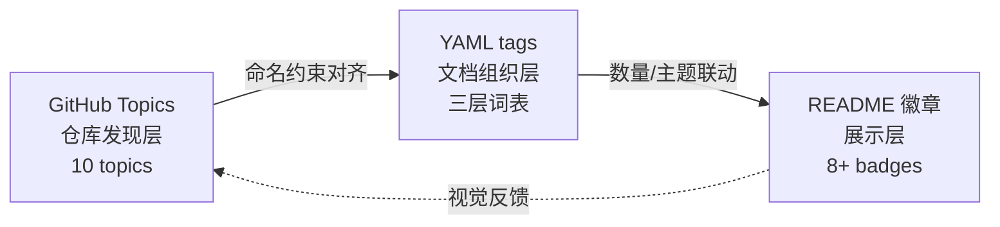

# YYC³ 标签体系规范 v2.0

> **定位**：本文件是 YYC3-MiniMax-H3 仓库的标签唯一真源（Single Source of Truth），覆盖三层：GitHub Topics → 文档 YAML tags → README 徽章。
> **依据**：[YYC3-团队规范-开发标准.md §1.7 标签规范](YYC3-团队通用-标规文档/YYC3-团队规范-开发标准.md) + GitHub Topics 命名约束（小写连字符、≤50 字符、0-9a-z-）
> **created** 2026-09-03 · **version** v2.0.0

---

## 一、GitHub Topics（仓库级，10 个）

GitHub Topics 是仓库的**发现入口**（搜索/推荐/生态索引），命名受 GitHub 约束（仅小写字母、数字、连字符）。

| # | Topic | 层级 | 说明 |
| --- | ----- | ---- | ---- |
| 1 | `yanyucloudcube` | 品牌层 | YYC³ 家族标识（团队主 topic） |
| 2 | `yyc3` | 品牌层 | 家族简称 |
| 3 | `minimax-h3` | 领域层 | 模型标识 |
| 4 | `ai-video-generation` | 领域层 | 生成任务域 |
| 5 | `digital-human` | 领域层 | 数字人应用 |
| 6 | `lip-sync` | 领域层 | 口型同步核心能力 |
| 7 | `diffsynth-studio` | 引擎层 | 推理引擎 |
| 8 | `apple-silicon` | 平台层 | M4 Max MPS |
| 9 | `dgx-spark` | 平台层 | 生产迁移目标 |
| 10 | `yyc3-family` | 生态层 | 家族项目互联 |

**设置命令**（需 gh CLI 已登录）：

```bash
gh repo edit YYC-Cube/YYC3-MiniMax-H3 \
  --add-topic yanyucloudcube --add-topic yyc3 \
  --add-topic minimax-h3 --add-topic ai-video-generation \
  --add-topic digital-human --add-topic lip-sync \
  --add-topic diffsynth-studio --add-topic apple-silicon \
  --add-topic dgx-spark --add-topic yyc3-family
```

---

## 二、文档 YAML tags 体系（文档级）

遵循开发标准 §1.7「类型 → 功能 → 模块」+ v1 实践沉淀，**2-4 个标签**，类型层优先。

### 2.1 标签词表（本仓可用全集）

| 层级 | 标签 |
| ---- | ---- |
| 类型层（必选其一） | `guide` `reference` `policy` `plan` `report` `design` `index` |
| 功能层 | `pipeline` `audit` `architecture` `visualization` `deployment` `troubleshooting` `prompt` `scoring` `version-control` |
| 模块层 | `minimax-h3` `ref2va` `fl2va` `m4-max` `dgx-spark` `syncnet` `manifest` `dashboard` `yyc3-standard` `app-hub` |

### 2.2 现存文档标签合规化对照（v1 → v2）

| 文档 | v1 现状 | v2 规范化 | 说明 |
| ---- | ------- | --------- | ---- |
| docs/01 环境部署 | `[deployment],[m4-max],[miniforge],[pytorch-mps]` | `[guide],[deployment],[m4-max]` | miniforge/pytorch-mps 属细节细节，非词表；类型层缺失 |
| docs/02 避坑指南 | 同类杂项 | `[guide],[troubleshooting],[m4-max]` | 类型层补齐 |
| docs/03 批量迭代 | 同类 | `[guide],[pipeline],[manifest]` | 模块层精确到 manifest |
| docs/04 演进规划 | 同类 | `[design],[pipeline],[version-control]` | 规划类归 design |
| docs/05 全局释义 | 同类 | `[reference],[yyc3-standard]` | 词条型归 reference |
| docs/06 现状分析（活文档） | 同类 | `[report],[audit],[pipeline]` | 活文档=实时报告 |
| docs/07 闭环预期 | 同类 | `[design],[pipeline]` | - |
| docs/08 开发者文档 | 同类 | `[reference],[architecture],[manifest]` | API 参考型 |
| docs/09 文档体系审核 | 同类 | `[report],[version-control],[yyc3-standard]` | - |
| docs/10 DGX 运维 | 同类 | `[guide],[deployment],[dgx-spark]` | - |
| prompts/README | `[prompt],[minimax-h3],[ref2va],[fl2va]` | `[guide],[prompt],[ref2va]` | 4 个取 3，去模块冗余 |
| dashboard/面板 md | `[dashboard],[visualization]` | `[reference],[dashboard],[visualization]` | 类型层补齐 |
| docs/legacy ×2 | `[legacy],[archive]` | 保留（归档特例，不受词表约束） | deprecated 状态已表意 |
| 会话区 00/01/02/03 | v1.0 定义 | 保持（会话文档自成体系） | 不回改 |

> **执行策略**：上表已在本会话批量回写至各文档 YAML front matter（见执行日志）。

### 2.3 新文档命名-标签速查

```text
写新文档时：类型层(1) + 功能层(1-2) + 模块层(0-1)，总数 2-4
例：新写《口型评分调参手册》 → tags: [guide],[scoring],[syncnet]
```

---

## 三、README 徽章体系（展示层）

与 topics/tags 联动的可视化出口，当前 8 枚已就位（README v2.0.1）。标签联动规则：

| 徽章 | 联动源 | 维护时机 |
| ---- | ------ | -------- |
| Team / Version / License | 仓库元数据 | 版本变更时 |
| Platform（M4/DGX） | topics `apple-silicon`/`dgx-spark` | 迁移里程碑 |
| Python / PyTorch | topics 平台层 | 环境大版本升级 |
| Pipeline Closed-Loop | topics `ai-video-generation` | 流水线节点增减 |
| Docs 10+ Guides | 文档 tags 数量 | 新增指南文档 |

新增徽章从 [shields.io](https://shields.io) 生成，色板对齐团队 VI：主色 `#00d4aa`（青绿）· 辅色 `#00b4d8` · 家族紫 `#8b5cf6`。

---

## 四、三层联动总览



- **发现**：外部用户经 Topics 搜到仓库 → README 徽章建立第一印象
- **组织**：协作者经 YAML tags 检索文档 → 词表保证语义一致
- **追溯**：三处变更必须同频（改 topic 时检查徽章，改词表时扫描全库 tags）

---

## 变更历史

| 版本 | 日期 | 变更内容 | 作者 |
| ---- | ---- | -------- | ---- |
| v2.0.0 | 2026-09-03 | 建立 GitHub Topics + YAML 词表 + 徽章三层体系；现存文档合规化回写 | Impl Expert |

---

<div align="center">

> 「***YanYuCloudCube***」
> 「***<admin@0379.email>***」
> 「***Words Initiate Quadrants, Language Serves as Core for the Future***」
> 「***All things converge in cloud pivot; Deep stacks ignite a new era of intelligence***」

**© 2025-2026 YanYuCloudCube™. All Rights Reserved.**

</div>
